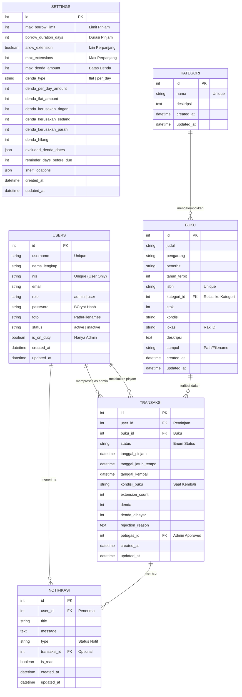

# Entity Relationship Diagram (ERD)
## Perpustakaan Sekolah Digital

Dokumen ini mendeskripsikan struktur basis data dan hubungan antar entitas dalam aplikasi Perpustakaan Sekolah Digital.

---

### Visual Diagram

Diagram berikut mencakup semua tabel utama dan relasinya. Hubungan digambarkan menggunakan notasi *Crow's Foot*.

---

### Detail Relasi

| Relasi | Tipe Hubungan | Deskripsi Teknis |
| :--- | :---: | :--- |
| **Kategori ↔ Buku** | `1 : N` | Satu kategori dapat berisi banyak buku. Menghapus kategori akan men-set `kategori_id` buku menjadi `NULL`. |
| **Buku ↔ Transaksi** | `1 : N` | Satu buku dapat dipinjam berkali-kali secara historis. Transaksi merekam status unik peminjaman. |
| **Users ↔ Transaksi** | `1 : N` | User sebagai "Peminjam" (user_id) dan Admin sebagai "Petugas" (petugas_id) yang memvalidasi. |
| **Users ↔ Notifikasi** | `1 : N` | Setiap notifikasi ditujukan kepada user tertentu. Menghapus user akan menghapus seluruh notifikasinya. |
| **Transaksi ↔ Notifikasi** | `1 : N` | Notifikasi seringkali dipicu oleh perubahan status pada transaksi tertentu. |

###  Alur Status (Workflow)

Perjalanan status sebuah buku dari peminjaman hingga pengembalian:

1. **PENGAJUAN**: `pending` (Menunggu Approval Admin)
2. **AKTIF**:
   - `approved` (Buku sedang dipinjam)
   - `overdue` (Terlambat dikembalikan - Sistem Auto-check)
   - `extension_pending` (Menunggu Approval Perpanjangan)
3. **SELESAI**:
   - `returned` (Kembali - Baik/Rusak)
   - `rejected` (Ditolak Admin)
   - `lost` (Dinyatakan Hilang)

> [!NOTE]
> Sistem memblokir peminjaman baru jika user masih memiliki transaksi berstatus **AKTIF** untuk buku yang sama.

---

### Catatan Teknis Database

- **Engine**: MySQL 8.0 / MariaDB
- **ORM**: Sequelize (dengan Migrations)
- **Soft Deletes**: Tidak digunakan untuk menjaga integritas data transaksi, record dihapus secara permanen atau dinonaktifkan via field `status`.
- **Audit**: Field `created_at` dan `updated_at` tersedia di semua tabel untuk pelacakan waktu.

---

###  Referensi Status (Quick Lookup)

- **Status "aktif"** (mencegah peminjaman buku yang sama): `pending`, `approved`, `overdue`, `return_pending`, `extension_pending`
- **Status "selesai"** (boleh meminjam buku yang sama lagi): `returned`, `rejected`, `lost`
