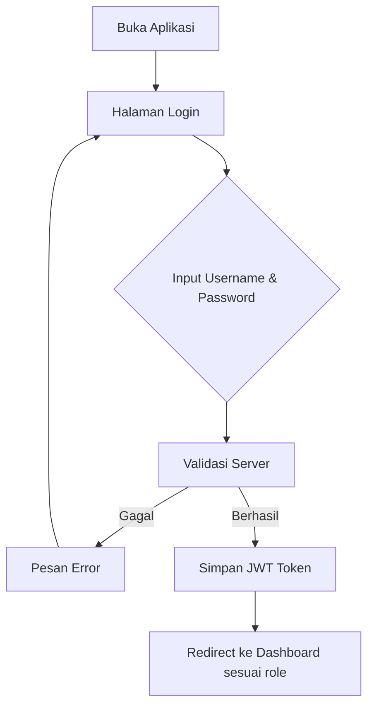
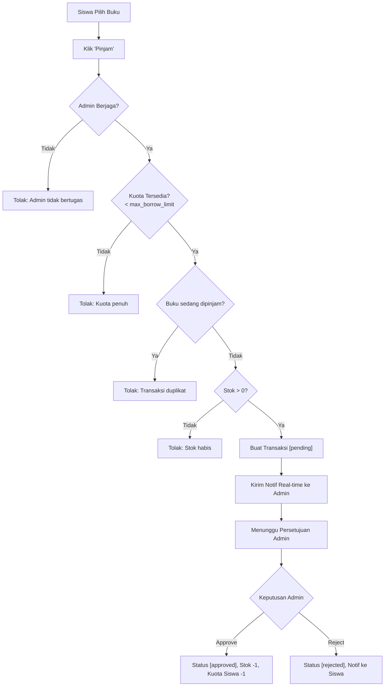
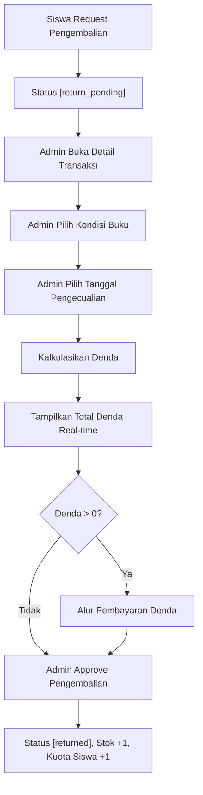
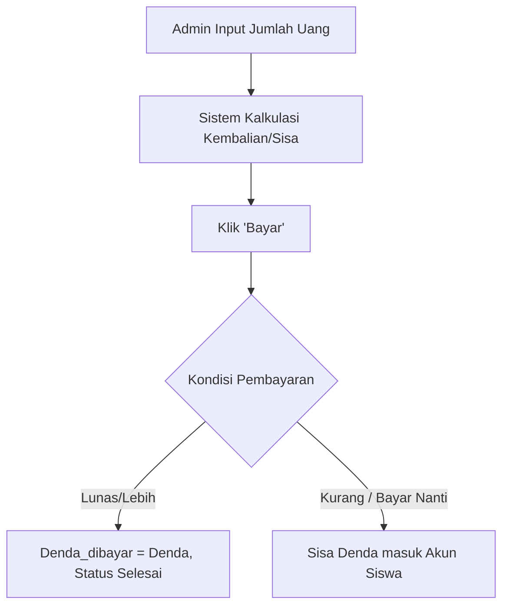

# Deskripsi Program — Aplikasi Perpustakaan Sekolah Digital

## 1. Latar Belakang & Tujuan

Aplikasi Perpustakaan Sekolah Digital adalah sistem manajemen perpustakaan berbasis web yang dirancang untuk meningkatkan efisiensi layanan perpustakaan sekolah secara digital. Sistem ini dilaksanakan dalam rangka **Uji Kompetensi Keahlian (UJIKOM)** dan bertujuan untuk:

- Mendigitalisasi proses peminjaman dan pengembalian buku
- Mempermudah pendataan koleksi buku dan keanggotaan
- Menyediakan sistem notifikasi real-time antara siswa dan petugas
- Menggantikan pencatatan manual yang rawan kesalahan

---

## 2. Ruang Lingkup

| Aspek | Keterangan |
| --- | --- |
| **Pengguna** | Seluruh warga sekolah (siswa, guru, staf) |
| **Peran** | Admin (petugas perpustakaan) dan User (peminjam / siswa) |
| **Model Penggunaan** | **Face-to-face** (Tatap Muka) di dalam perpustakaan |
| **Perangkat** | PC/Laptop (Admin) dan PC/Tablet (Siswa) |
| **Jaringan** | Offline — berjalan di localhost atau jaringan lokal (LAN) sekolah |
| **Koneksi** | Tidak memerlukan koneksi internet publik |

---

## 3. Arsitektur Sistem

Sistem menggunakan arsitektur **Client–Server** dengan komunikasi REST API dan WebSocket:

```text
┌─────────────────────────────────────────────────────────────────┐
│                        CLIENT (Browser)                         │
│                                                                 │
│   React + Vite + Tailwind CSS                                   │
│   ┌───────────┐  ┌───────────┐  ┌───────────┐  ┌───────────┐  │
│   │  Halaman  │  │ Komponen  │  │  Context  │  │  Socket   │  │
│   │  (Pages)  │  │ (Reusable)│  │  (State)  │  │  Client   │  │
│   └───────────┘  └───────────┘  └───────────┘  └───────────┘  │
└──────────┬──────────────────────────────────────┬───────────────┘
           │  HTTP REST (Axios)                    │  WebSocket (Socket.IO)
           ▼                                       ▼
┌─────────────────────────────────────────────────────────────────┐
│                    SERVER (Node.js / Express)                    │
│                                                                 │
│  ┌──────────┐  ┌──────────┐  ┌──────────┐  ┌──────────────┐   │
│  │  Routes  │→ │Controller│→ │  Model   │  │  Socket.IO   │   │
│  │ (8 modul)│  │(7 file)  │  │(Sequelize│  │  (Realtime)  │   │
│  └──────────┘  └──────────┘  │  ORM)    │  └──────────────┘   │
│                               └────┬─────┘                     │
│  ┌──────────┐  ┌──────────┐        │     ┌──────────────────┐  │
│  │  Middleware│  │  Utils   │        │     │   Cron Jobs      │  │
│  │ (Auth JWT)│  │(Settings │        │     │ (Overdue Checker)│  │
│  └──────────┘  │  Cache)  │        │     └──────────────────┘  │
│                └──────────┘        │                           │
└────────────────────────────────────┼───────────────────────────┘
                                     ▼
┌─────────────────────────────────────────────────────────────────┐
│                       DATABASE (MySQL)                           │
│                                                                 │
│  Settings │ Users │ Kategori │ Buku │ Transaksi │ Notifikasi   │
└─────────────────────────────────────────────────────────────────┘
```

---

## 4. Stack Teknologi

### Backend (Server)

| Package | Versi | Fungsi |
| --- | --- | --- |
| `express` | ^5.x | Framework HTTP server |
| `sequelize` | ^6.x | ORM untuk MySQL |
| `mysql2` | ^3.x | MySQL client (driver) |
| `socket.io` | ^4.x | Komunikasi real-time WebSocket |
| `jsonwebtoken` | ^9.x | Autentikasi berbasis JWT |
| `bcryptjs` | ^3.x | Hashing password |
| `express-validator` | ^7.x | Validasi input request |
| `cors` | ^2.x | Cross-Origin Resource Sharing |
| `dotenv` | ^17.x | Manajemen environment variables |
| `multer` | ^2.x | Upload file (sampul buku, foto user) |
| `swagger-ui-express` | ^5.x | Antarmuka dokumentasi API (OpenAPI/Swagger) |
| `swagger-jsdoc` | ^6.x | Generator dokumentasi API dari JSDoc |
| `node-cron` | ^3.x | Scheduled jobs (cek overdue) |
| `nodemon` | ^3.x | Auto-restart server (dev only) |

### Frontend (Client)

| Package | Versi | Fungsi |
| --- | --- | --- |
| `react` | ^18.x | UI library |
| `vite` | ^7.x | Build tool & dev server |
| `tailwindcss` | ^3.x | Utility-first CSS framework |
| `react-router-dom` | ^6.x | Client-side routing |
| `axios` | ^1.x | HTTP client untuk API calls |
| `socket.io-client` | ^4.x | Koneksi WebSocket ke server |
| `lucide-react` | ^0.x | Icon library |

### Testing

| Package | Fungsi |
| --- | --- |
| `vitest` | Unit test framework (v4.x Server / v3.x Client) |
| `@vitest/coverage-v8` | Code coverage reporting |

---

## 5. Fitur Utama

### Untuk Siswa (Role: User)

- **Registrasi & Login** — Daftar mandiri, login dengan username + password
- **Pencarian Buku** — Cari buku berdasarkan judul, pengarang, kategori, atau ISBN
- **Request Peminjaman** — Ajukan permohonan pinjam buku (butuh admin berjaga)
- **Request Pengembalian** — Ajukan permohonan kembali buku (butuh admin berjaga)
- **Request Perpanjangan** — Minta perpanjangan masa pinjam
- **Notifikasi Real-time** — Terima notif saat request diproses: disetujui, ditolak, reminder jatuh tempo
- **Riwayat Transaksi** — Lihat histori semua peminjaman

### Untuk Admin (Role: Admin)

- **Toggle Berjaga** — Aktif/nonaktif status berjaga (`is_on_duty`)
- **Kelola Buku** — CRUD buku beserta upload sampul
- **Kelola Kategori** — CRUD kategori buku
- **Kelola Anggota** — CRUD data siswa, import bulk via CSV
- **Proses Transaksi** — Approve/reject peminjaman, pengembalian, perpanjangan
- **Kalkulasi Denda** — Hitung denda real-time dengan opsi pengecualian tanggal
- **Proses Pembayaran** — Catat pembayaran denda (tunai, uang pas/lebih/kurang/bayar nanti)
- **Buku Hilang** — Proses pengembalian buku yang sebelumnya hilang (`returnLost`)
- **Pengaturan Global** — Kelola semua setting aplikasi (denda, kuota, durasi, dll.)
- **Laporan** — Lihat statistik dan ringkasan aktivitas perpustakaan

---

## 6. Alur Aplikasi

### 6.1 Alur Login



### 6.2 Alur Peminjaman Buku (Siswa)



### 6.3 Alur Pengembalian & Denda (Admin)



### 6.4 Alur Pembayaran Denda



### 6.5 Kebijakan Admin Berjaga

Seluruh aksi siswa (request peminjaman, pengembalian, perpanjangan) hanya dapat dilakukan ketika minimal satu admin memiliki `is_on_duty = true`. Jika tidak ada admin berjaga, sistem menolak request dengan pesan informatif.

---

## 7. Business Rules Penting

| Rule | Nilai Default | Konfigurasi |
| --- | --- | --- |
| Kuota pinjam per siswa | 3 buku | Dinamis via Settings |
| Durasi pinjam | 7 hari | Dinamis via Settings |
| Denda keterlambatan | Rp 1.000/hari | Dinamis (flat atau per hari) |
| Batas maksimal denda | Rp 50.000 | Dinamis via Settings |
| Maks perpanjangan | 1 kali | Dinamis via Settings |
| Peminjaman buku sama | Tidak boleh saat transaksi masih aktif | — |
| Buku hilang — stok | Berkurang permanen | Admin bisa pulihkan via `returnLost` |
